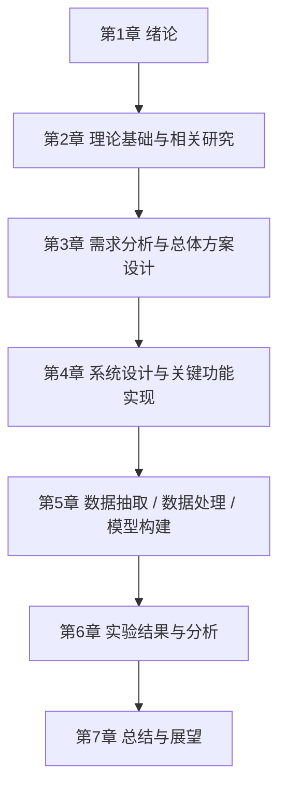
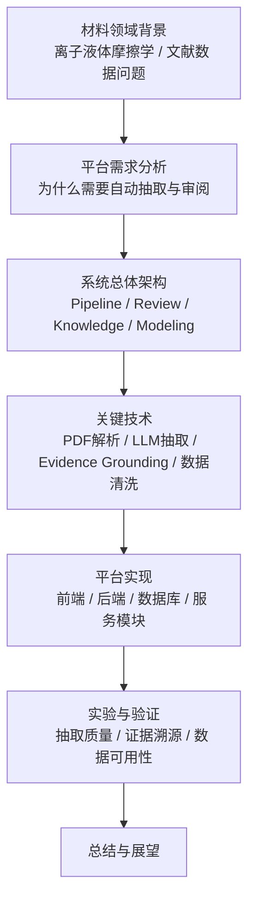

# 材料学院毕设论文架构图

更新时间：2026-04-04

## 1. 适用场景

本文档用于材料学院本科毕业设计论文的整体架构梳理，适合以下类型课题：

- 材料数据平台
- 文献数据抽取与知识库构建
- 材料性能预测
- 材料信息学与智能分析
- 面向具体材料体系的实验数据整理与建模

如果结合 IonicLink 项目，本架构尤其适合：

- 离子液体摩擦学文献数据抽取
- 材料实验数据结构化
- 文献证据溯源与知识沉淀
- 数据驱动的性能分析与预测

---

## 2. 论文总架构图



---

## 3. 按章节展开的论文结构

## 3.1 第1章 绪论

核心任务：

- 说明课题背景
- 说明研究意义
- 说明国内外研究现状
- 明确本文研究内容与目标
- 给出论文整体结构安排

建议写法：

- 背景从材料领域真实痛点切入
- 问题要落在“数据获取难、整理成本高、可复用性差、难以支持后续分析”上
- 研究目标要明确到“构建平台 / 建立流程 / 实现抽取 / 支持分析”

## 3.2 第2章 理论基础与相关研究

核心任务：

- 介绍课题涉及的材料学基础知识
- 介绍数据处理或模型相关理论
- 梳理相关研究工作
- 说明现有工作的不足

如果结合 IonicLink，可写内容包括：

- 离子液体摩擦学基本概念
- 文献数据结构化的常见方法
- PDF 文献抽取与信息抽取技术
- 证据溯源与人工校核问题
- 材料数据平台或材料信息学研究现状

## 3.3 第3章 需求分析与总体方案设计

核心任务：

- 明确系统要解决什么问题
- 明确用户对象
- 明确业务流程
- 给出总体架构

建议本章至少包含：

- 功能需求分析
- 数据流分析
- 系统总体架构设计
- 技术路线说明

## 3.4 第4章 系统设计与关键功能实现

核心任务：

- 详细描述平台的模块设计
- 展示核心功能实现方式
- 说明前后端、数据库、算法或服务之间的关系

如果结合 IonicLink，可拆成：

- 文献上传与管理模块
- 文献抽取与运行监控模块
- 证据溯源与审阅模块
- 知识检索与数据管理模块
- 数据集构建与模型分析模块

## 3.5 第5章 数据抽取 / 数据处理 / 模型构建

这一章是材料学院毕设里最容易拉开质量差距的一章。

它不应只写“做了什么”，而应写清：

- 数据从哪里来
- 怎样清洗
- 怎样标准化
- 怎样构造成可分析对象
- 怎样建立模型或分析方法

可写内容：

- 数据来源与样本范围
- 字段设计与结构化规则
- evidence-first 抽取流程
- 候选记录与最终记录筛选规则
- 数据清洗与质量控制
- 特征构建
- 模型训练与参数设置

## 3.6 第6章 实验结果与分析

核心任务：

- 展示平台效果
- 展示抽取效果或模型效果
- 分析结果的合理性
- 与已有方法或人工方式进行比较

建议包括：

- 抽取准确率或有效率分析
- evidence grounding 质量分析
- 数据覆盖率与可用率分析
- 模型预测性能分析
- 典型案例分析

## 3.7 第7章 总结与展望

核心任务：

- 总结本文工作
- 说明创新点或实际价值
- 指出存在不足
- 给出后续改进方向

---

## 4. 面向材料学院毕设的研究流程图


---

## 5. 如果你的题目基于 IonicLink，推荐的论文结构映射

可以将论文题目理解为：

**面向离子液体摩擦学文献的智能数据抽取与知识管理平台设计**

对应章节映射如下：



---

## 6. 推荐的论文目录草案

```text
摘要
Abstract

第1章 绪论
1.1 课题背景与研究意义
1.2 国内外研究现状
1.3 本文主要研究内容
1.4 论文结构安排

第2章 理论基础与关键技术
2.1 离子液体摩擦学基础
2.2 材料文献数据结构化方法
2.3 PDF文献解析与信息抽取技术
2.4 数据清洗与知识组织方法

第3章 系统需求分析与总体设计
3.1 系统建设目标
3.2 功能需求分析
3.3 数据流程分析
3.4 系统总体架构设计
3.5 数据库与对象模型设计

第4章 平台关键模块设计与实现
4.1 文献上传与任务管理模块
4.2 文献抽取模块
4.3 Evidence Grounding与审阅模块
4.4 知识检索与数据管理模块
4.5 数据集构建与分析模块

第5章 数据处理流程与实验方案
5.1 数据来源与样本选择
5.2 字段设计与结构化规则
5.3 候选记录生成与筛选机制
5.4 数据清洗与标准化
5.5 实验设置与评价指标

第6章 实验结果与分析
6.1 文献抽取结果分析
6.2 Evidence Grounding效果分析
6.3 数据质量分析
6.4 典型案例分析
6.5 系统性能与应用价值分析

第7章 总结与展望
7.1 研究工作总结
7.2 创新点与不足
7.3 后续工作展望

参考文献
致谢
附录
```

---

## 7. 产品、系统、论文三者之间的对应关系


更具体的对应关系如下：

- `Home / Pipeline / Review / Knowledge / Modeling`
  对应论文中的“系统需求分析与总体设计”
- `抽取链路 / evidence grounding / review`
  对应论文中的“关键技术与关键模块实现”
- `数据质量 / 抽取效果 / 模型性能`
  对应论文中的“实验结果与分析”

---

## 8. 给材料学院毕设写作的建议

为了让论文更像材料学院的毕业论文，而不是单纯的软件说明书，建议注意以下几点：

- 背景要从材料领域真实问题出发，而不是从“我做了一个网站”出发
- 数据字段设计要体现材料专业语义，而不是泛化表结构
- 实验分析要强调材料体系、实验条件、性能指标之间的关系
- 评价平台时，不只写功能实现，还要写对材料研究流程的帮助
- 结论部分要强调该平台对材料数据积累、知识整理和后续性能分析的价值

---

## 9. 一句话总结

材料学院毕设论文的高质量写法，不是把平台功能依次罗列，而是围绕“材料问题 -> 数据获取 -> 数据处理 -> 系统实现 -> 实验验证 -> 工程价值”这条主线展开。
