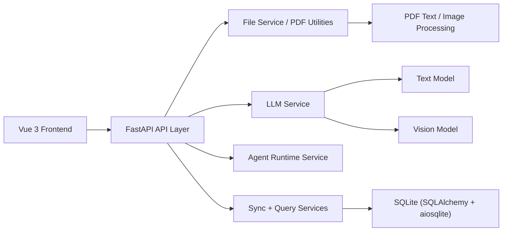

# IonicLink

<p align="center">
  <strong>Ionic Liquid Tribology Literature Intelligence Platform</strong>
</p>

<p align="center">
  面向离子液体摩擦学文献的全栈智能处理平台，覆盖 PDF 导入、多模态抽取、证据回溯、结构化入库与数据检索全流程。
</p>

<p align="center">
  
  
  
  
</p>

---

## Quickstart (English)

> 中文文档紧随其后 — see [项目概述](#项目概述) below.

**What this is.** IonicLink turns ionic-liquid tribology PDFs into a
searchable, evidence-grounded database. Upload a paper, the multimodal LLM
pipeline extracts friction / diffusion records, every value links back to
the page, paragraph, or figure it came from, and the result is reviewable
and queryable in the workbench.

**Who it's for.** Tribology researchers building structured datasets from
literature. You bring the PDFs and an LLM API key; you get back rows with
provenance.

### Run it locally

```bash
# 1. Backend — FastAPI on :8000
cd backend
pip install -r requirements.txt
cp ../.env.docker.example ../.env          # then fill in OPENAI_API_KEY (or OPENROUTER_API_KEY)
uvicorn main:app --reload

# 2. Frontend — Vite dev server on :5173
cd frontend
npm install
npm run dev
```

Open <http://localhost:5173>, sign in with the bootstrap admin
(`IONICLINK_ADMIN_USERNAME` / `IONICLINK_ADMIN_PASSWORD` from your `.env` —
**change these before exposing the app**), and you land on the home screen
with a single **Upload PDF papers** action.

### First five minutes

1. **Upload** a tribology or diffusion PDF on the home screen.
2. Watch the extraction run in **Monitor** — stages, candidate counts, and
   per-paper progress show live.
3. Open **Library → Database** to see the extracted rows; click any row to
   jump to the highlighted source region in the PDF.
4. Use the **Integrated Explorer** to filter by material, lubricant, DOI,
   or numeric ranges.
5. If a row is wrong, edit it inline — the change persists and the audit
   trail is preserved.

### Operational notes

- DB lives at `backend/data/ioniclink.db` (SQLite). No migration tool yet
  — schema changes are applied at startup.
- One-off per-paper data corrections live under
  [`scripts/data-fixes/`](scripts/data-fixes/README.md) with a backup-first
  convention.
- Docker: `docker compose up` brings the stack up once `.env` is filled.

---

## 项目概述

IonicLink 是一个聚焦 **离子液体摩擦学文献** 的智能抽取系统。项目采用 Vue 3 前端分析工作台与 FastAPI 后端服务协同，将 PDF 论文转化为可追溯、可审阅、可检索的结构化实验数据。

当前仓库已经具备完整的核心闭环：

1. 上传 PDF 文献。
2. 通过文本 + 视觉 LLM 流程抽取元数据与摩擦学记录。
3. 跟踪抽取进度、运行阶段与 Agent 状态。
4. 将结果回溯到原始页码、文本片段和图表区域。
5. 将标准化数据持久化到 SQLite。
6. 在前端工作台中检索、审阅与编辑累计数据。

## 项目价值

摩擦学文献的人工整理成本高、重复劳动多、可追溯性弱。IonicLink 旨在解决这类问题，提供：

- 从文献到数据库的研究数据生产流程。
- 带证据定位能力的抽取，而不是黑盒式一次性解析。
- 面向人工复核的结构化结果与交互式工作台。
- 面向高质量科研数据集建设的基础平台。

## 核心能力

| 能力模块 | 说明 |
| --- | --- |
| PDF 导入 | 上传本地 PDF，并注册为抽取任务 |
| 多模态抽取 | 结合 PDF 文本解析、页面分类与 LLM 图文抽取 |
| 元数据提取 | 提取 DOI 与文献基础信息，便于后续索引 |
| 进度追踪 | 记录抽取阶段、进度日志、候选数与最终结果数 |
| 证据回溯 | 将记录映射回 PDF 页码、文本片段与高亮区域 |
| 置信度评分 | 计算记录置信度，并支持人工提升置信度 |
| 数据持久化 | 基于 SQLAlchemy 将文献和记录写入 SQLite |
| 检索与探索 | 支持按材料、润滑剂、DOI 与数值范围过滤 |
| 重处理流程 | 支持重新抽取已有文献或重新执行 IL 解析 |
| Agent 可观测性 | 提供 Agent 运行状态与使用指标接口 |

## 前端工作台

前端目前已经形成面向研究流程的多视图工作台：

- `Guide`：项目引导与快速上手
- `Dashboard`：数据总览与抽取概况
- `Workspace`：上传、抽取、聊天、Agent 面板与集成式数据探索
- `Monitor`：运行过程监控
- `Literature`：文献列表与文献级管理
- `Grounding`：PDF 证据查看与高亮定位

## 系统架构



### Frontend

- **Framework**: Vue 3 + TypeScript + Vite
- **UI**: Tailwind CSS, Radix Vue, Lucide icons
- **Charts**: `chart.js`, `vue-chartjs`
- **PDF rendering**: `pdfjs-dist`
- **HTTP client**: `axios`

### Backend

- **Framework**: FastAPI
- **ORM**: SQLAlchemy 2.x async
- **Database**: SQLite via `aiosqlite`
- **PDF processing**: PyMuPDF (`fitz`), Pillow
- **LLM integration**: OpenAI-compatible API client, optional multimodal model split
- **Config**: `python-dotenv`

## 目录结构

```text
IonicLink/
+-- frontend/                 # Vue 3 前端应用
|   +-- src/
|   |   +-- components/       # 工作台、看板、PDF、监控、探索相关组件
|   |   +-- lib/api.ts        # 前端 API 封装
|   |   `-- App.vue           # 主应用入口
|   `-- package.json
+-- backend/                  # FastAPI 后端服务
|   +-- main.py               # 应用入口与路由注册
|   +-- database.py           # 异步 SQLite 引擎与初始化逻辑
|   +-- routers/              # 抽取、同步、检索、Agent 接口
|   +-- services/             # LLM、同步、文件、评分、运行时服务
|   +-- models/               # Pydantic 与 ORM 模型
|   +-- utils/                # PDF 和坐标处理工具
|   `-- data/ioniclink.db     # 运行期 SQLite 数据库
+-- temp_uploads/             # 上传与临时处理文件
+-- databackup/               # 数据备份目录
`-- Reference/                # 参考资料
```

## API 概览

后端当前注册的主要接口分组如下：

| 路由分组 | 用途 |
| --- | --- |
| `/api` | 上传、抽取、聊天、PDF 证据、抽取运行记录 |
| `/api/sync` | 文献同步、替换、重处理、IL 修复 |
| `/api/records` | 记录搜索、选项查询、更新、删除、置信度提升 |
| `/api/agents` | Agent 运行状态与使用指标 |
| `/docs` | FastAPI 自动生成的 Swagger 文档 |
| `/health` | 服务健康检查 |

## 快速开始

### 1. 克隆仓库

```bash
git clone <your-repository-url>
cd IonicLink
```

### 2. 启动后端

```bash
cd backend
python -m venv .venv
.venv\Scripts\activate
pip install -r requirements.txt
uvicorn main:app --reload
```

后端默认地址：

```text
http://localhost:8000
```

Swagger 文档：

```text
http://localhost:8000/docs
```

### 3. 启动前端

打开一个新的终端：

```bash
cd frontend
npm install
npm run dev
```

前端默认地址：

```text
http://localhost:5173
```

## 环境变量

### Backend `.env`

后端通过 `python-dotenv` 读取环境变量。按需创建 `backend/.env`：

```env
OPENAI_API_KEY=your_api_key
OPENAI_BASE_URL=https://api.openai.com/v1
LLM_PROVIDER=
OPENROUTER_BASE_URL=https://openrouter.ai/api/v1
OPENROUTER_API_KEY=
OPENROUTER_SITE_URL=
OPENROUTER_APP_NAME=IonicLink

LLM_TEXT_MODEL=Pro/deepseek-ai/DeepSeek-V3.2
LLM_VISION_MODEL=Qwen/Qwen3-VL-32B-Instruct
LLM_VISION_API_KEY=

CORS_ALLOW_ORIGINS=http://localhost:5173,http://127.0.0.1:5173
CORS_ALLOW_CREDENTIALS=true
```

说明：

- `OPENAI_BASE_URL` 采用 OpenAI Compatible 方式，可指向兼容网关或代理服务。
- `LLM_VISION_API_KEY` 为空时会回退到 `OPENAI_API_KEY`。
- SQLite 数据库会自动创建在 `backend/data/ioniclink.db`。

OpenRouter example:

```bash
LLM_PROVIDER=openrouter
OPENROUTER_API_KEY=sk-or-...
OPENROUTER_SITE_URL=https://your-domain.example
OPENROUTER_APP_NAME=IonicLink
LLM_TEXT_MODEL=openai/gpt-4.1-mini
LLM_VISION_MODEL=google/gemini-2.5-flash
```

### Frontend `.env`

如果 API 服务地址不是 `http://localhost:8000`，可创建 `frontend/.env`：

```env
VITE_API_URL=http://localhost:8000
```

## 开发命令

### Frontend

```bash
cd frontend
npm install
npm run dev
npm run build
```

### Backend

```bash
cd backend
pip install -r requirements.txt
uvicorn main:app --reload
```

### Tests

仓库当前已经包含后端 `pytest` 用例，常见执行方式如下：

```bash
cd backend
pytest
```

## 数据流转

```text
PDF Upload
  -> file registration
  -> text / image extraction
  -> LLM text + vision analysis
  -> candidate validation and scoring
  -> grounded structured records
  -> SQLite persistence
  -> searchable exploration and manual refinement
```

## 技术亮点

- 面向摩擦学场景的领域化抽取流程，而不是泛化 OCR 拼装。
- 支持证据文本、图表区域与页级高亮的 Source Grounding 能力。
- 后端采用异步架构，并通过初始化逻辑完成轻量级增量字段补齐。
- 抽取、同步、检索、评分、运行时监控分层明确，便于继续演进。
- 前端并非单纯 API Demo，而是面向分析和复核的工作台。

## 当前状态

目前仓库已经具备可运行的全栈基线能力，包括：

- Vue 3 客户端应用
- FastAPI 后端服务
- SQLite 本地持久化
- PDF 上传与抽取接口
- 可检索的数据探索能力
- Agent 状态监控接口
- 后端抽取与数据库相关测试文件

如果要继续向“正式大项目”演进，优先值得补强的部分包括：

- 容器化部署
- CI/CD 流程
- 前端测试体系
- 鉴权与权限控制
- 发布与版本管理规范

## 推荐下一步

如果你希望把这个仓库进一步打磨成更完整的工程项目，建议优先补以下内容：

1. 增加 `backend/.env.example` 与 `frontend/.env.example`。
2. 增加 Docker / Docker Compose，实现一键本地启动。
3. 增加前端构建与后端 `pytest` 的 CI。
4. 引入正式迁移工具，替代仅靠启动时补字段的方式。
5. 增加示例 PDF 与示例数据，便于演示和复现。

## License

当前仓库尚未发现 `LICENSE` 文件；若要公开分发，建议补充明确的开源协议。

## 致谢

项目基于 Vue、Vite、FastAPI、SQLAlchemy、PyMuPDF、Chart.js 以及 OpenAI Compatible LLM 工具链构建，用于面向科研场景的领域化文献抽取。

## Local Dev And Docker

The default API and CORS settings are now aligned for both local development and Docker deployment.

Supported frontend origins by default:

- `http://localhost:5173`
- `http://127.0.0.1:5173`
- `http://localhost:8080`
- `http://127.0.0.1:8080`

Recommended combinations:

- Local frontend (`npm run dev`) + local backend (`uvicorn main:app --reload`)
- Local frontend (`npm run dev`) + Docker backend (`docker compose up -d backend`)
- Docker frontend + Docker backend (`docker compose up -d`)

Notes:

- Local Vite development uses the `/api` proxy in `frontend/vite.config.ts`
- Docker frontend uses Nginx reverse proxy from `frontend/nginx.conf`
- Docker backend CORS can still be overridden with `CORS_ALLOW_ORIGINS` in `.env`
